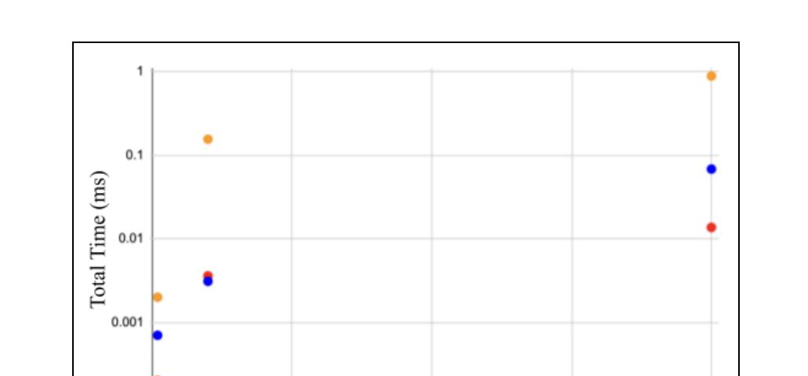

# Analysis of Algorithms: Searching & Sorting

Empirical performance comparison of three sorting algorithms: `shellSort`, `bubbleSort`,
and an optimized variant, `bubbleSort2`, that exits early once a full pass makes no swaps.

## What's implemented

`Sorting.java` holds all three algorithms, each instrumented to count **comparisons**,
**swaps**, and **total execution time**. `Driver.java` runs six comparative test suites —
array sizes 10 / 100 / 1000, each sorted and unsorted - plus edge cases: an empty array,
a single-element array, a reverse-ordered array, and an array with many duplicates.

```
javac *.java
java Driver
```
Note: the full run prints several large arrays to the console and takes ~20–30 seconds

## Results

| Array Size | Ordered/Random | Algorithm | Comparisons | Swaps | Total time (ms) |
|---|---|---|---|---|---|
| 10 | Random | bubbleSort | 45 | 25 | 0.0318 |
| 10 | Random | bubbleSort2 | 81 | 25 | 0.0145 |
| 10 | Random | shellSort | 69 | 15 | 0.0096 |
| 10 | Ordered | bubbleSort | 45 | 0 | 0.0020 |
| 10 | Ordered | bubbleSort2 | 9 | 0 | 0.0007 |
| 10 | Ordered | shellSort | 22 | 0 | 0.0002 |
| 100 | Random | bubbleSort | 4,950 | 2,328 | 0.2673 |
| 100 | Random | bubbleSort2 | 8,514 | 2,328 | 0.3696 |
| 100 | Random | shellSort | 3,098 | 506 | 0.0412 |
| 100 | Ordered | bubbleSort | 4,950 | 0 | 0.1557 |
| 100 | Ordered | bubbleSort2 | 99 | 0 | 0.0036 |
| 100 | Ordered | shellSort | 503 | 0 | 0.0031 |
| 1000 | Random | bubbleSort | 499,500 | 246,516 | 7.0693 |
| 1000 | Random | bubbleSort2 | 961,038 | 246,516 | 9.6534 |
| 1000 | Random | shellSort | 60,611 | 8,399 | 0.4959 |
| 1000 | Ordered | bubbleSort | 499,500 | 0 | 0.8881 |
| 1000 | Ordered | bubbleSort2 | 999 | 0 | 0.0137 |
| 1000 | Ordered | shellSort | 8,006 | 0 | 0.0683 |

**Analysis:** all three algorithms make 0 swaps on already-sorted arrays, as
expected. `bubbleSort2` makes exactly 9 / 99 / 999 comparisons on ordered arrays of size
10 / 100 / 1000; one full pass (n−1 comparisons) is enough to confirm the array is
sorted and exit early. `bubbleSort` and `bubbleSort2` always make the same number of
swaps, since they share the same underlying swap logic.

Execution time vs. array size, unsorted arrays


For unsorted input, `shellSort` is consistently fastest, and the gap widens sharply at
n = 1000: `bubbleSort` and `bubbleSort2` both show the quadratic O(n²) blow-up typical of
bubble sort on random data, while `shellSort`'s O(n log n) average case keeps its time
much lower.



For already-sorted input, `bubbleSort2`'s early-exit optimization makes it the fastest
across the board — its best case is O(n), since the loop only runs for one pass.
`bubbleSort` has no such optimization and still iterates fully even when the array is
already sorted. `shellSort` stays efficient but is slightly behind `bubbleSort2` here,
since it still performs some comparisons despite the sorted input.
